# System Architecture - CAMARA QoD Fine-tuning Project

## High-Level System Overview

This document describes the complete system architecture of the CAMARA QoD API fine-tuning project, built using Supervised Fine-Tuning (SFT) with QLoRA and Direct Preference Optimization (DPO).

---

## System Architecture Diagram

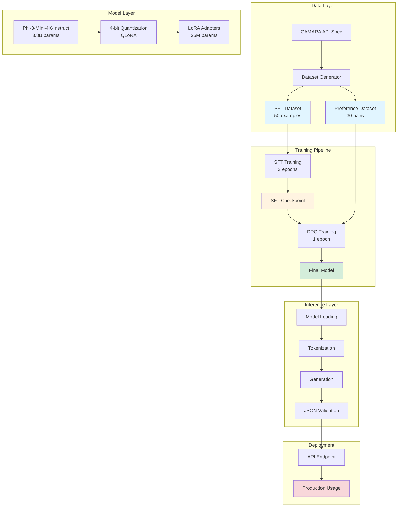

---

## Complete Training Pipeline

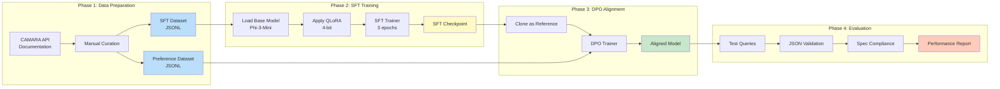

---

## Component Architecture

### 1. **Data Components**

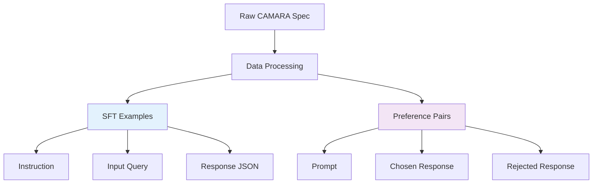

**SFT Dataset Structure:**
```json
{
 "instruction": "System prompt",
 "input": "User request",
 "response": "Valid CAMARA JSON"
}
```

**Preference Dataset Structure:**
```json
{
 "prompt": "User request",
 "chosen": "CAMARA-compliant JSON",
 "rejected": "Hallucinated/wrong JSON"
}
```

---

### 2. **Model Architecture**

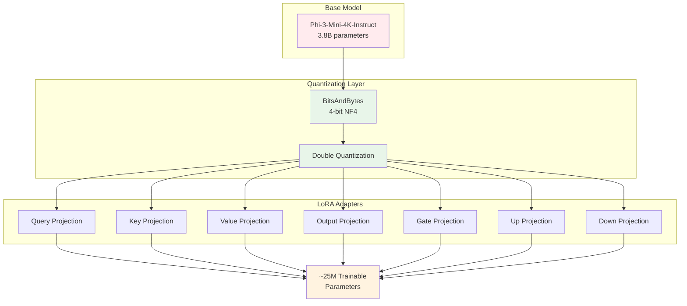

**Configuration:**
- **Rank (r):** 16
- **Alpha:** 16
- **Dropout:** 5%
- **Target Modules:** QKV, O, Gate, Up, Down projections
- **Trainable %:** 0.66% of total parameters

---

### 3. **Training Architecture**

#### SFT (Supervised Fine-Tuning)

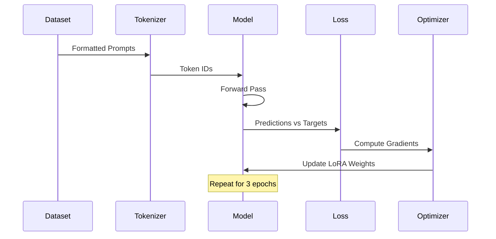

**Hyperparameters:**
- Learning Rate: 2e-4
- Batch Size: 2
- Gradient Accumulation: 4 steps
- Effective Batch Size: 8
- Optimizer: Paged AdamW 8-bit
- Scheduler: Linear warmup

---

#### DPO (Direct Preference Optimization)

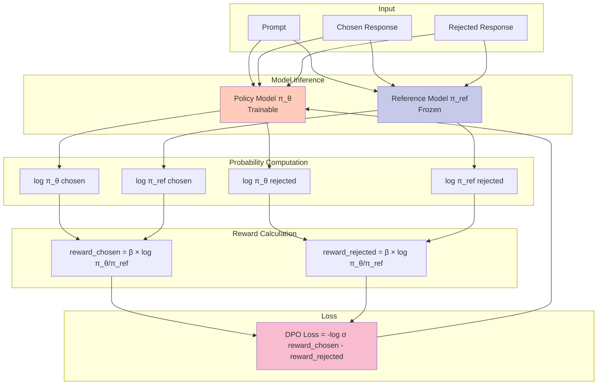

**DPO Key Components:**
- **β (KL penalty):** 0.1
- **Policy Model:** Trainable (updated)
- **Reference Model:** Frozen (SFT checkpoint)
- **Objective:** Maximize preference probability

---

### 4. **Inference Pipeline**

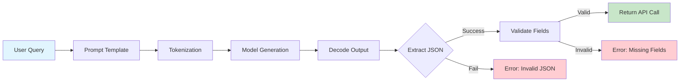

**Validation Checks:**
1. Valid JSON syntax
2. Required fields: `device`, `applicationServer`, `qosProfile`, `duration`
3. Correct data types
4. No hallucinated fields
5. Proper nesting structure

---

## Technology Stack

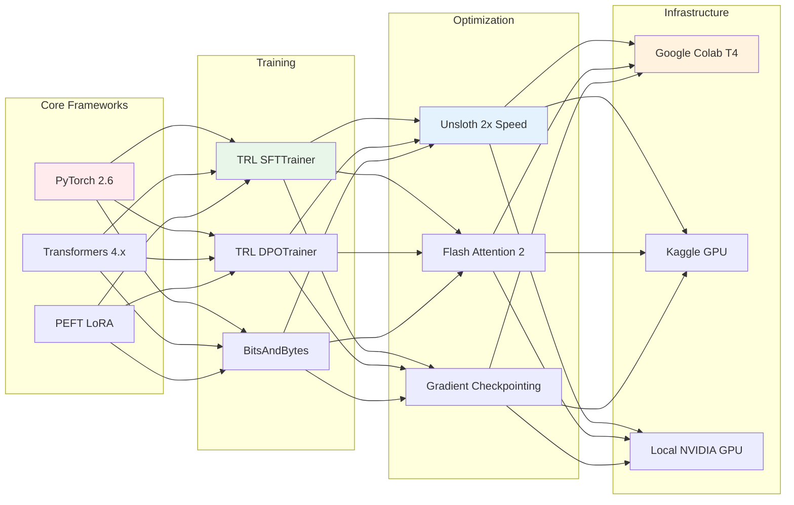

---

## Data Flow Diagram

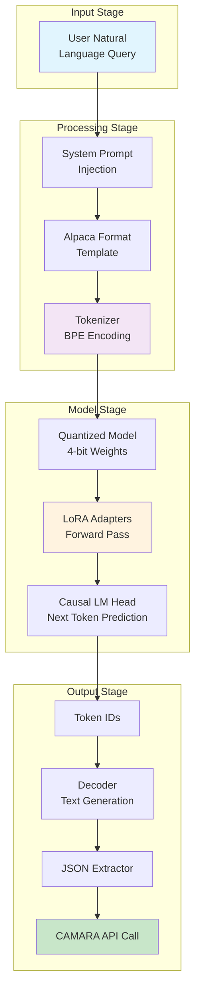

---

## Performance Optimization Strategies

### Memory Optimization

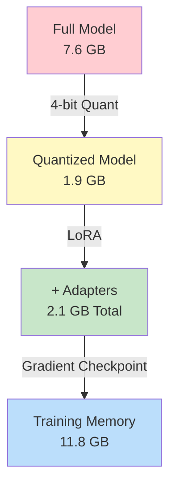

**Techniques:**
1. **4-bit Quantization:** Reduces model size by 75%
2. **LoRA:** Only train 0.66% of parameters
3. **Gradient Checkpointing:** Trade compute for memory
4. **Paged AdamW:** Efficient optimizer memory usage

---

### Speed Optimization

| Technique | Speedup | Memory Saved |
|-----------|---------|--------------|
| Unsloth Kernels | 2x | 0% |
| Flash Attention 2 | 1.5x | 20% |
| Mixed Precision FP16 | 1.3x | 50% |
| Gradient Accumulation | 1x | Enables larger batch |

---

## Model Versioning

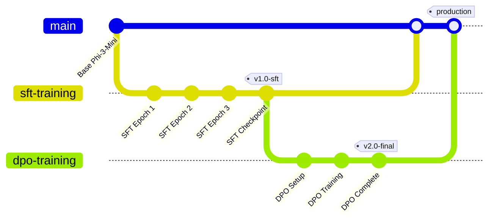

**Checkpoints:**
1. **Base Model:** `microsoft/Phi-3-mini-4k-instruct`
2. **SFT Model:** `camara_qod_lora_model/` (after supervised training)
3. **DPO Model:** `camara_qod_dpo_model/` (after preference alignment)
4. **Merged Model:** `camara_qod_final_model/` (production-ready)

---

## Deployment Architecture

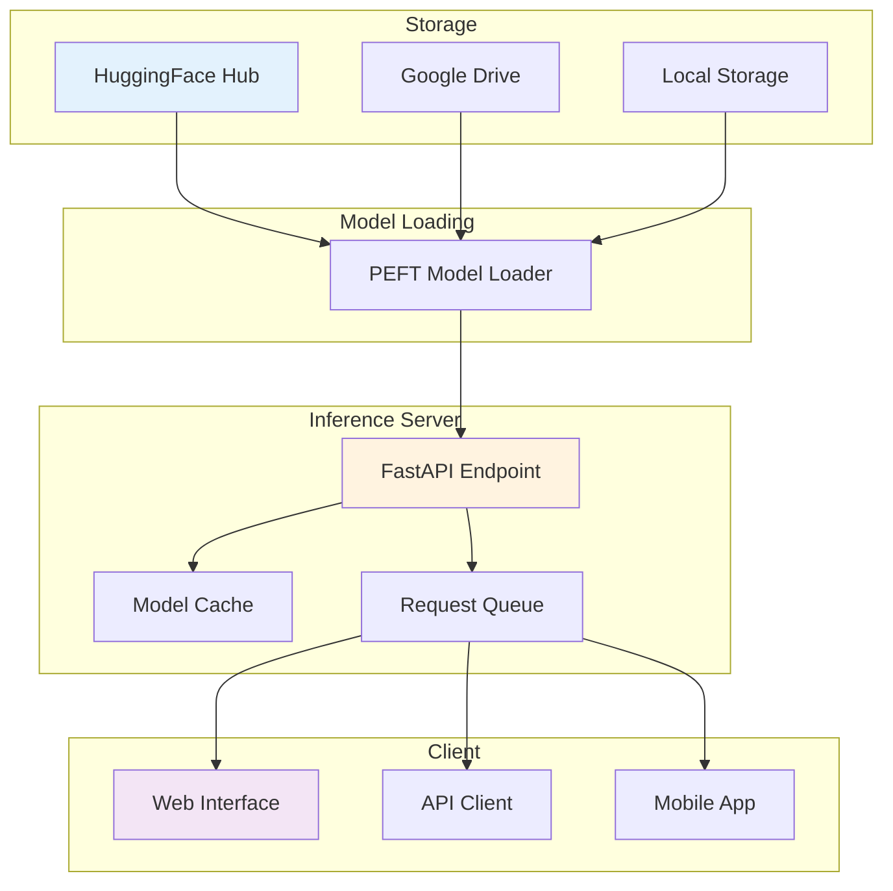

---

## Metrics & Monitoring

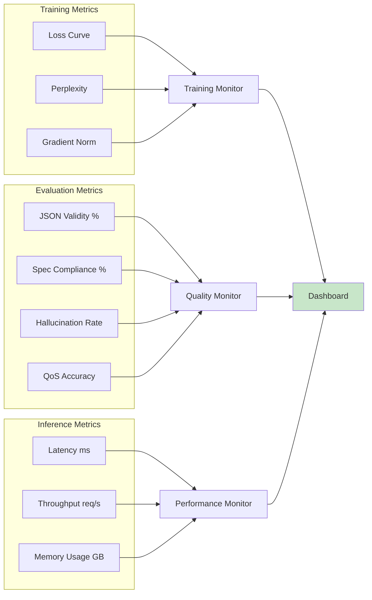

---

## End-to-End Workflow

1. **Dataset Creation** → Manual curation from CAMARA spec
2. **SFT Training** → Learn API structure and field mappings
3. **DPO Training** → Eliminate hallucinations via preference learning
4. **Evaluation** → Validate on test queries
5. **Deployment** → Host model for inference
6. **Monitoring** → Track performance and quality

---

## Development Environment

```yaml
Hardware:
 - GPU: NVIDIA T4 (Colab) / GTX 1650 (Local)
 - VRAM: 16GB (T4) / 4GB (GTX 1650)
 - RAM: 12GB+ recommended

Software:
 - Python: 3.10+
 - CUDA: 11.8 / 12.1
 - PyTorch: 2.6.0+
 - Transformers: 4.36+
 - PEFT: 0.7+
 - TRL: 0.7+

Platforms:
 - Google Colab (Free T4 GPU)
 - Kaggle Notebooks (30hrs/week GPU)
 - Local NVIDIA GPU
 - Lightning AI Studios
```

---

## References

- **Model:** [microsoft/Phi-3-mini-4k-instruct](https://huggingface.co/microsoft/Phi-3-mini-4k-instruct)
- **CAMARA Spec:** [QualityOnDemand API](https://github.com/camaraproject/QualityOnDemand)
- **DPO Paper:** [Rafailov et al., 2023](https://arxiv.org/abs/2305.18290)
- **LoRA Paper:** [Hu et al., 2021](https://arxiv.org/abs/2106.09685)
- **QLoRA Paper:** [Dettmers et al., 2023](https://arxiv.org/abs/2305.14314)
